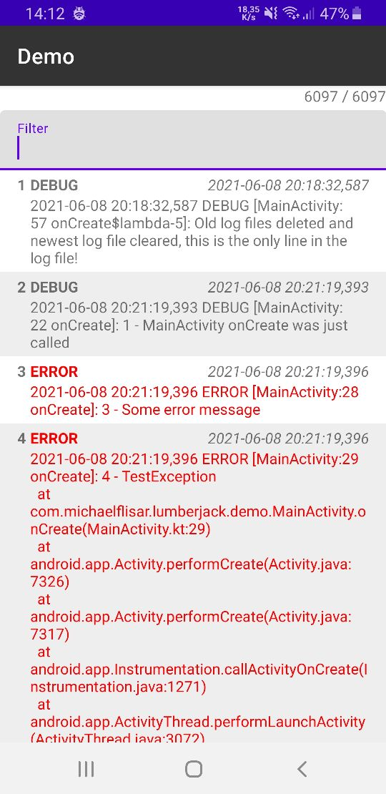

### Lumberjack [](https://jitpack.io/#MFlisar/Lumberjack)

### What does it do?

A simple logger for JackWhartons [Timber](https://github.com/JakeWharton/timber) logging library (v4!) with following *features*:

* trees for:
  * logging to console (with the ability to add clickable links to the calling line in the calling class)
  * files (one file per day, select between numbered log file names or date based log file names)
* customise each tree to whatever you want or extend them or add your own tree
* little utility class to log time and laps (the `T` class) 
* by default, this library will create tags if no custom tag is provided like "[CLASSNAME:LINE] FUNCTION" e.g. `[MainActivity:32 onCreate]: Some log`
* feedback module that contains extension functions for `L` to send feedback or to show a notification that will send a feedback on click:
  * `L.sendFeedback()`... sends a feedback via IntentChooser with an optional files appended
* notification module that contains functions to show info/error notifications
* viewer module that contains an activity to show a log file with filter functions

**All features are splitted into separate modules, just include the modules you want to use!**

### Dependencies

| Dependency | Version |
|:-|-:|
| [Timber](https://github.com/JakeWharton/timber) | `4.7.1` |

### Gradle (via [JitPack.io](https://jitpack.io/))

1) add jitpack to your project's `build.gradle`:

```groovy
repositories {
    maven { url "https://jitpack.io" }
}
```

2) add the compile statement to your module's `build.gradle`:

```groovy
dependencies {
  
    // base module (NECESSARY)
    implementation 'com.github.MFlisar.Lumberjack:lumberjack-library:<LATEST-VERSION>'
    // modules (OPTIONAL)
    implementation 'com.github.MFlisar.Lumberjack:lumberjack-filelogger:<LATEST-VERSION>'
    implementation 'com.github.MFlisar.Lumberjack:lumberjack-feedback:<LATEST-VERSION>'
    implementation 'com.github.MFlisar.Lumberjack:lumberjack-notification:<LATEST-VERSION>'
    implementation 'com.github.MFlisar.Lumberjack:lumberjack-viewer:<LATEST-VERSION>'
}
```

### Usage

Once in your app do following:

```kotlin
// simply console logger
L.plant(ConsoleTree())

// if desired, disable all logging in release
// L.enabled = Build.DEBUG
```

##### Module `filelogger`

```kotlin
// a file logger (optional)
// here you can setup a date file or a number file file logger - all variables like folder, filename, extension, file to keep and so on can be customised
// when creating the setup
// following default setup keeps log files for 7 days and creates a new file each day and names them "log_YYYYmmdd.log" by default
val fileLoggingSetup = FileLoggingSetup.DateFiles(context) 
L.plant(FileLoggingTree(fileLoggingSetup))
```

##### Module `feedback`

```kotlin
// send feedback with the log file appended (chooser to select a mail will be opened, no internet permission needed!)
// mail receiver is optional, it defaults to the lumberjack_mail_receiver resource string so its fine if you instead of providing the mail address here
// you simply set the resource string to your mail address instead
L.sendFeedback(context, fileLoggingSetup, "some.mail@gmail.com")
```

##### Module `notification`

```kotlin
// show a crash notifcation - on notification click the user can send a feedback mail including the log file
L.showCrashNotification(context, logFile /* may be null */, "some.mail@gmail.com", R.mipmap.ic_launcher, "NotificationChannelID", 1234 /* notification id */)

// show a notification to allow the user the report some interesting internal proplems
L.showCrashNotification(context, fileLoggingSetup, "some.mail@gmail.com", R.mipmap.ic_launcher, "NotificationChannelID", 1234 /* notification id */)

// show an information notification to the user (or for dev purposes)
L.showInfoNotification(context, "NotificationChannelID", 1234 /* notification id */, "Notification Title", "Notification Text", R.mipmap.ic_launcher)

// as above, but on notification click it will open the log viewer showing the provided log file
L.showInfoNotification(context, logFile, "NotificationChannelID", 1234 /* notification id */, "Notification Title", "Notification Text", R.mipmap.ic_launcher)
```

##### Module `viewer`

```kotlin
// show the log viewer activity (mail address is optional, if it's null, the send mail entry will be removed from the viewers menu)
L.showLog(context, fileLoggingSetup, "some.mail@gmail.com")
```



Check out the demo to see more

### Example - LOGGING

The logger is simply used like following:

```kotlin
// this simply logs a message
L.d { "Simpe log" }
// simply log with custom tag
L.tag("CUSTOM-TAG").d { "Some message with a tag" }
// Log and only run log code based on a function / boolean flag
L.logIf { true }?.d { "Is logged, as flag is true" }
L.logIf { someFunction() }?.d { "Is logged and only executed if someFunction returns true" }
```

If used with `logIf` the expression is only executed if `logIf` returns true so it's save to keep all the logging lines in production code.

### Example - OUTPUT

```
[MainActivity:26 onCreate]: Main activity created (MainActivity.kt:26)
[MainActivity:27 onCreate]: Test message - count: 0 (MainActivity.kt:27)
[MainActivity:28 onCreate]: Test error (MainActivity.kt:28)
    java.lang.Throwable: ERROR
        at com.michaelflisar.lumberjack.demo.MainActivity.onCreate(MainActivity.kt:28)
        at android.app.Activity.performCreate(Activity.java:7183)
        at android.app.Instrumentation.callActivityOnCreate(Instrumentation.java:1220)
        at android.app.ActivityThread.performLaunchActivity(ActivityThread.java:2908)
        at android.app.ActivityThread.handleLaunchActivity(ActivityThread.java:3030)
        at android.app.ActivityThread.-wrap11(Unknown Source:0)
        at android.app.ActivityThread$H.handleMessage(ActivityThread.java:1696)
        at android.os.Handler.dispatchMessage(Handler.java:105)
        at android.os.Looper.loop(Looper.java:164)
        at android.app.ActivityThread.main(ActivityThread.java:6938)
        at java.lang.reflect.Method.invoke(Native Method)
        at com.android.internal.os.Zygote$MethodAndArgsCaller.run(Zygote.java:327)
        at com.android.internal.os.ZygoteInit.main(ZygoteInit.java:1374)
```