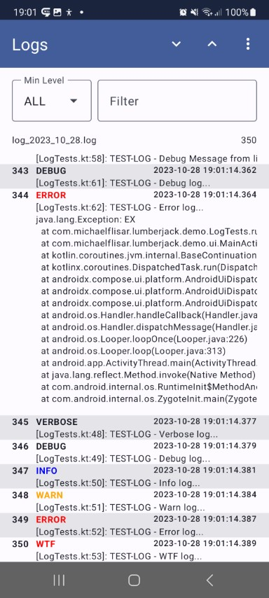

[](https://central.sonatype.com/namespace/io.github.mflisar.lumberjack)
[](https://android-arsenal.com/api?level=21)
[](https://kotlinlang.org/)
[](https://kotlinlang.org/docs/multiplatform.html)
[](LICENSE)

<h1 align="center">Lumberjack</h1>

A <b>lazy logging library</b>.

## :heavy_check_mark: Features

This is a **full logging library** with a build in way to log to **console**, **file** or any **custom** place as well as optional extensions to send a log file via mail or show it on the device.

**All features are splitted into separate modules, just include the modules you want to use!**

## :camera: Screenshots

|  |  |  |  |
| :-: | :-: | :-: | :-: |

## :link: Dependencies

|      Dependency       | Version |                     Infos                      |
|:---------------------:|:-------:|:----------------------------------------------:|
| Compose Multiplatform | `1.7.0` | based on compose `1.7.1` and material3 `1.3.0` |

> [!NOTE]  
> I try to use as few experimental APIs as possible, but the `composeviewer` module does use `ExposedDropdownMenuBox` and `TopAppBar` which are still marked as experimental in material3 `1.3.0`. I will provide new versions as soon as possible if experimental APIs change or become stable.

| Module                       | Dependency                                                                                                                                         | Version                       |
|:-----------------------------|:---------------------------------------------------------------------------------------------------------------------------------------------------|:------------------------------|
| `core`                       | -                                                                                                                                                  |                               |
| **Implementations**          |                                                                                                                                                    |
| `implementation-lumberjack`  | -                                                                                                                                                  |                               |
| **Logger**                   |                                                                                                                                                    |                               |
| `logger-console`             | -                                                                                                                                                  |                               |
| `logger-file`                | -                                                                                                                                                  |                               |
| **Extensions**               |                                                                                                                                                    |                               |
| `extension-feedback`         | [FeedbackManager](https://github.com/MFlisar/FeedbackManager)                                                                                      | `2.1.0`                       |
| `extension-notification`     | [FeedbackManager](https://github.com/MFlisar/FeedbackManager)                                                                                      | `2.1.0`                       |
| `extension-viewer`           | [FeedbackManager](https://github.com/MFlisar/FeedbackManager)<br>[FastScroller](https://github.com/quiph/RecyclerView-FastScroller)                | `2.1.0`<br>`1.0.0`            |
| `extension-composeviewer`    | [FeedbackManager](https://github.com/MFlisar/FeedbackManager)                                                                                      | `2.1.0`                       |

**Timber Version**

| Module                      | Dependency                                                                                                                                         | Version                       |
|:----------------------------|:---------------------------------------------------------------------------------------------------------------------------------------------------|:------------------------------|
| **Implementations**         |                                                                                                                                                    |
| `implementation-timber`     | [Timber](https://github.com/JakeWharton/timber)                                                                                                    | `4.7.1`                       |
| **Logger**                  |                                                                                                                                                    |                               |
| `timber-logger-console`     | [Timber](https://github.com/JakeWharton/timber)                                                                                                    | `4.7.1`                       |
| `timber-logger-file`        | [Timber](https://github.com/JakeWharton/timber)<br>[slf4j](https://www.slf4j.org/)<br>[logback-android](https://github.com/tony19/logback-android) | `4.7.1`<br>`2.0.7`<br>`3.0.0` |

## :elephant: Gradle

This library is distributed via [maven central](https://central.sonatype.com/).

*build.gradle.kts*

```kts
val lumberjack = "<LATEST-VERSION>"

// core
implementation("io.github.mflisar.lumberjack:core:$lumberjack")

// if you want to use the lumberjack logger
implementation("io.github.mflisar.lumberjack:implementation-lumberjack:$lumberjack")
implementation("io.github.mflisar.lumberjack:logger-console:$lumberjack")
implementation("io.github.mflisar.lumberjack:logger-file:$lumberjack")

// if you want to use the timber logger
// implementation("io.github.mflisar.lumberjack:implementation-timber:$lumberjack")
// implementation("io.github.mflisar.lumberjack:timber-logger-console:$lumberjack")
// implementation("io.github.mflisar.lumberjack:timber-logger-file:$lumberjack")

// Extensions that work with any implementation
implementation("io.github.mflisar.lumberjack:extension-feedback:$lumberjack")
implementation("io.github.mflisar.lumberjack:extension-notification:$lumberjack")
implementation("io.github.mflisar.lumberjack:extension-viewer:$lumberjack")
implementation("io.github.mflisar.lumberjack:extension-composeviewer:$lumberjack")
```

## :zap: Modules

| Module                      | Info     | Description                                                                                                                  |
|-----------------------------|----------|------------------------------------------------------------------------------------------------------------------------------|
| `core`                      |          | the core module - must always be included                                                                                    |
| **Implementations**         |          |
| `implementation-lumberjack` |          | the main implementation of the logger - either this or the timber implementation must always be included                     |
| `implementation-timber`     |          | the main implementation based on timber of the logger - either this or the lumberjack implementation must always be included |
| **Logger**                  |          |                                                                                                                              |
| `logger-console`            | optional | a console logger for the lumberjack implementation                                                                           |
| `logger-file`               | optional | a console logger for the lumberjack implementation                                                                           |
| `timber-logger-console`     | optional | a console logger for the timber implementation                                                                               |
| `timber-logger-file`        | optional | a console logger for the timber implementation                                                                               |
| **Extensions**              |          |                                                                                                                              |
| `extension-feedback`        | optional | an extension for easy email feedbacks                                                                                        |
| `extension-notification`    | optional | an extension for exception notification with easy email feedbacks on click                                                   |
| `extension-viewer`          | optional | a log viewer based on XML                                                                                                    |
| `extension-composeviewer`   | optional | a compsoe log viewer                                                                                                         |

## </> Basic Usage

<details open>
<summary><b>1.</b>Setup library - (Lumberjack Style)</summary>

```kotlin
class App : Application() {

    override fun onCreate() {

         // 1) install the implemantion
         L.init(LumberjackLogger)
         
         // 2) install loggers
         L.plant(ConsoleLogger())
         val setup = FileLoggerSetup.Daily(this)
         L.plant(FileLogger(setup))
    }

}
```

</details>

<details>
<summary><b>1.</b>Setup library - (Timber Style)</summary>

```kotlin
class App : Application() {

    override fun onCreate() {
      
         // 1) install the implemantion
         L.init(TimberLogger)
         
         // 2) install loggers (trees) 
         Timber.plant(ConsoleTree())
         val setup = FileLoggingSetup.DateFiles.create(this  )
         Timber.plant(FileLoggingTree(setup))
    }

}
```

</details>

<details open>
<summary><b>2.</b>Usage</summary>

```kotlin
// wherever you want use one of L.* functions for logging
// all the functions are implemented as inline functions with lambdas - this means,
// everything inside the lambda is only executed if the log is really ussed

L.d { "a debug log" }
L.e { "a error log" }
L.e(e)
L.e(e) { "an exception log with an additonal message" }
L.v { "TEST-LOG - Verbose log..." }
L.d { "TEST-LOG - Debug log..." }
L.i { "TEST-LOG - Info log..." }
L.w { "TEST-LOG - Warn log..." }
L.e { "TEST-LOG - Error log..." }
L.wtf { "TEST-LOG - WTF log..." }

// optional tags work like following
L.tag("LEVEL").d { "Tagged log message..." }

// you can log something optionally like following
L.logIf { false }?.d { "This will never be logged because logIf evaluates to false..." }

// manual log levels
L.log(Level.DEBUG) { "Debug level log via L.log instead of L.d" }
```

</details>

<details>
<summary><b>3.</b>Filtering Logs (Lumberjack Style)</summary>

```kotlin
// typealias LumberjackFilter = (level: Level, tag: String?, time: Long, fileName: String, className: String, methodName: String, line: Int, msg: String?, throwable: Throwable?) -> Boolean
val filter = object : LumberjackFilter {
    override fun invoke(
        level: Level,
        tag: String?,
        time: Long,
        fileName: String,
        className: String,
        methodName: String,
        line: Int,
        msg: String?,
        throwable: Throwable?
    ): Boolean {
        // decide if you want to log this message...
        return true
    }
}
// the filter can then be attached to any logger implementation
val consoleLogger = ConsoleLogger(filter = filter)
val fileLogger = FileLogger(filter = filter)
```

</details>

<details>
<summary><b>3.</b>Filtering Logs (Timber Style)</summary>

> [!TIP]
> The lumberjack implementation allows you more granular filter options as well as a custom filter for each logger implementation!

```kotlin
TimberLogger.filter = object: IFilter {
    override fun isTagEnabled(baseTree: BaseTree, tag: String): Boolean {
        // decide if you want to log this tag on this tree...
        return true
    }
    override fun isPackageNameEnabled(packageName: String): Boolean {
        // decide if you want to log if the log comes from a class within the provided package name
        return true
    }
}
```

</details>

<details>
<summary><b>4.</b>Other settings</summary>

```kotlin

// if desired you can enable/disable all logs completely 
// e.g. in a release build like following 
// => you probably would want to do this inside the application after the init of Lumberjack
L.enable(BuildConfig.DEBUG)

// Alternatively every logger does support an enabled flag as well
val consoleLogger = ConsoleLogger(enabled = BuildConfig.DEBUG)
val fileLogger = FileLogger(enabled = !BuildConfig.DEBUG, ...)

```
    
</details>

## :computer: Supported Platforms

**Supported Platforms**

This is a **KMP (kotlin multiplatform)** library and the provided modules do support following platforms:

> [!NOTE]  
> iOS would be supported theoretically, but currently I don't know iOS and don't own an apple device - the problem is only that I can't replace `ThreadLocal` and `StackTraceElement` in a non jvm environment.
> Additionally the console logging would need an iOS implementation as well.
> If you know how this can be done and want to contribute, that would be much appreciated.

| Modules                   | Android | iOS | jvm | Information |
|:--------------------------|---------|-----|-----|-------------|
| core                      | √       | √   | √   |             |
| implementation-lumberjack | √       |     | √   | (1)         |
| logger-console            | √       |     | √   | (2)         |
| logger-file               | √       | √   | √   |             |
| extension-feedback        | √       |     |     | (3)         |
| extension-notification    | √       |     |     | (3)         |
| extension-viewer          | √       |     |     | (4)         |
| extension-composeviewer   | √       | √   |  √  | (5)         |

* (1) iOS is missing support because I don't know how to handle `ThreadLocal` and `StackTraceElement` inside iOS - a pull request would be much appreciated!
* (2) iOS is missing a simple console logging function - a pull request would be much appreciated! 
* (3) notification and feedback module are android specific modules and therefor only support android
* (4) the viewer module is and older view based module that just supports android based on its nature
* (5) would support iOS if the iOS logger-file module is implemented

**Timber Modules**

| Modules               | Android | iOS | jvm | Information |
|:----------------------|---------|-----|-----|-------------|
| implementation-timber | √       |     |     | (6)         |
| logger-timber-console | √       |     |     | (6)         |
| logger-timber-file    | √       |     |     | (6)         |

* (6) timber is only supported on android and therefor those modules are android only modules as well

## :tada: Demo

A full [demo](demo) is included inside the demo module, it shows nearly every usage with working examples.

## :information_source: More Informations

Extensions

* [Feedback](readmes/extension-feedback.md)
* [Notification](readmes/extension-notification.md)
* [ComposeViewer](readmes/extension-composeviewer.md)
* [Viewer](readmes/extension-viewer.md)

Advanced Stuff

* [Custom Logger Example](readmes/custom-logger.md)

## :page_with_curl: Notes

#### Timber vs Lumberjack implementation

This library fully supports Jack Whartons [Timber](https://github.com/JakeWharton/timber) logging library (v4!). And was even based on it until Lumberjack v6. Beginning with v6 I wrote new modules that work without timber which leads to a smaller and more versitile non timber version. I would advice you to use the non timber versions but if you want to you can simply use the timber modules I provide as well - whatever you prefer.

<details>
<summary><b>Why did I do this?</b></summary>

I decided to not use `Timber` myself anymore because of following reasons:

* `Timber` does explicitly rely on non lazy evaluating logging - it was a decision made by *Jack Wharton* and was the main reason to write `Lumberjack` at the beginning
* `Timber` is restrictive regarding class extensions - in v5 I would need access to a field to continue supporting timber in `Lumberjack`
* `Timber` is considered as working and feature requests and/or pull requests are not accepted if not really necessary - like e.g. my minimal one [here](https://github.com/JakeWharton/timber/issues/477).
* additionally I always needed to extend the `BaseTree` from `Timber` because of the limiting restrictions of the default `BaseTree` as well as it was to restrictive to make adjustment in it ( I always had a nearly 1:1 copy of it inside my library [here](https://github.com/MFlisar/Lumberjack/blob/595d4de0ae76338e66cf42f7324f51c945699fa8/library/implementations/timber/src/main/java/timber/log/BaseTree.kt#L9){target=_blank}). This was needed to allow to adjust the stack trace depth so that `Lumberjack` will log the correct calling place as a wrapper around `Timber`.

**This lead to my final decision**

`Lumberjack` does not need `Timber` and I provide a way to plug in `Timber` into `Lumberjack` now - this way using `Timber` and `Lumberjack` in combination is possible but not necessary anymore.

</details>