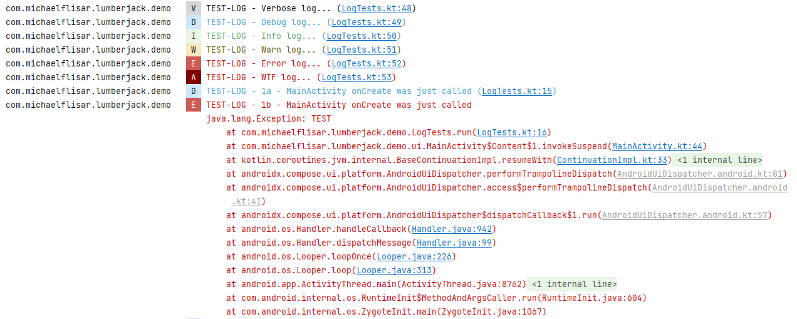

### About

[](https://jitpack.io/#MFlisar/Lumberjack)


This is a full logging library with a build in way to log to **console**, **file** or any **custom** place.

Additonally it supports *Jack Whartons* [Timber](https://github.com/JakeWharton/timber) logging library (v4!).

From v6 on this library's priority is to not use timber but it will still continue timber support! More about it [here](README - TIMBER.md).

**Example logs**

### Example - OUTPUT

##### Console




##### File

[Example log file](examples/log.txt)

### Features

* supports arbitrary loggers and provides data like **class name**, **function name**, **line number**
* can be used with a very small custom logging implementation or timber, whatever you prefer
* has extensions for
  * sending a log file via mail (no internet permissions - this is done by appending the log file to an `Intent` and let the user choose an email client)
  * a log file viewer (view or compose based)
  * a notification extension which allows you to show a notification which can show a non crashing but unexpected error and allows the user to click it and send a log file if desired

**All features are splitted into separate modules, just include the modules you want to use!**

### Dependencies

| Modules | Dependency | Version |
|:-|:-|-:|
| `core` | - |  |
| `implementation-lumberjack` | - |  |
| `implementation-timber` | [Timber](https://github.com/JakeWharton/timber) | `4.7.1` |
| `logger-console` | - |  |
| `logger-file` | - |  |
| `logger-timber-console` | [Timber](https://github.com/JakeWharton/timber) | `4.7.1` |
| `logger-timber-file` | [Timber](https://github.com/JakeWharton/timber) | `4.7.1` |
| | [slf4j](https://www.slf4j.org/) | `2.0.7` |
| | [logback-android](https://github.com/tony19/logback-android) | `3.0.0` |
| `extension-feedback` | [FeedbackManager](https://github.com/MFlisar/FeedbackManager) | `2.0.3` |
| `extension-notification` | [FeedbackManager](https://github.com/MFlisar/FeedbackManager) | `2.0.3` |
| `extension-viewer` | [FastScroller](https://github.com/quiph/RecyclerView-FastScroller) | `1.0.0` |
| `extension-viewer` | - | `2.0.3` |
| `extension-composeviewer` | - | `2.0.3` |

Following dependency only applies to the **extension-composeviewer** module:

| Dependency | Version | Infos |
|:-|-:|:-:|
| [Compose BOM](https://developer.android.com/jetpack/compose/bom/bom) | `2023.10.01` | [Mapping](https://developer.android.com/jetpack/compose/bom/bom-mapping) |
| Material3 | `1.1.2` | |

### Gradle (via [JitPack.io](https://jitpack.io/))

1) add jitpack to your project's `build.gradle`:

```groovy
repositories {
    maven { url "https://jitpack.io" }
}
```

2) add the compile statement to your module's `build.gradle`:

```groovy
dependencies {

  val lumberjack = "<LATEST-VERSION>"

  // 1) core module
  implementation("com.github.MFlisar.Lumberjack:core:$lumberjack")
  
  // 2) select a implementation (whichever one you prefer - my suggestion is to don't use timber if you don't need to
  //    as my own implementation is more compact
  // + select the desired loggers (or trees for timber) you want to use
  
  // 2.1) lumberjack versions
  implementation("com.github.MFlisar.Lumberjack:implementation-lumberjack:$lumberjack")
  implementation("com.github.MFlisar.Lumberjack:logger-console:$lumberjack")
  implementation("com.github.MFlisar.Lumberjack:logger-file:$lumberjack")
  
  // 2.2) timber versions
  implementation("com.github.MFlisar.Lumberjack:implementation-timber:$lumberjack")
  implementation("com.github.MFlisar.Lumberjack:logger-timber-console:$lumberjack")
  implementation("com.github.MFlisar.Lumberjack:logger-timber-file:$lumberjack")
  
  // 3) select optional extensions if needed
  implementation("com.github.MFlisar.Lumberjack:extension-feedback:$lumberjack")
  implementation("com.github.MFlisar.Lumberjack:extension-notification:$lumberjack")
  implementation("com.github.MFlisar.Lumberjack:extension-viewer:$lumberjack")
  implementation("com.github.MFlisar.Lumberjack:extension-composeviewer:$lumberjack")
}
```

### Setup

You should initialise `Lumberjack` once only - the best place is your apps `application`.

```kotlin
class App : Application() {
    override fun onCreate() {
      
      // ------------------------
      // Variant 1: the lumberjack version
      // ------------------------

      // 1) install the implemantion
      L.init(LumberjackLogger)
      
      // 2) install loggers
      L.plant(ConsoleLogger())
      val setup = FileLoggerSetup.Daily(this)
      L.plant(FileLogger(setup))

      // ------------------------
      // Variant 2: the timber version
      // ------------------------

      // 1) install the implemantion
      L.init(TimberLogger)

      // 2) install loggers (trees) 
      Timber.plant(ConsoleTree())
      val setup = FileLoggingSetup.DateFiles(this  )
      Timber.plant(FileLoggingTree(setup))
    }
}
```

That's it - now you can use `Lumberjack` everywhere in your app.

### Usage

```kotlin

// whereever you want use one of L.* functions for logging
// all the functions are implemented as inline functions with lambdas, this means, everything inside the lambda is only executed if the log is really executed
L.d { "a debug log" }
L.e { "a error log" }
L.e(e)
L.e(e) { "an exception log with an additonal message" }
L.v { "TEST-LOG - Verbose log..." }
L.d { "TEST-LOG - Debug log..." }
L.i { "TEST-LOG - Info log..." }
L.w { "TEST-LOG - Warn log..." }
L.e { "TEST-LOG - Error log..." }
L.wtf { "TEST-LOG - WTF log..." }

// optional tags work like following
L.tag("LEVEL").d { "Tagged log message..." }

// you can log something optionally like following
L.logIf { false }?.d { "This will never be logged because logIf evaluates to false..." }

// manual log levels
L.log(Level.DEBUG) { "Debug level log via L.log instead of L.d" }

// -----------------------
// Settings for Lumberjack
// -----------------------

// if desired you can enable/disable all logs completely - e.g. in release like following
L.enable(BuildConfig.DEBUG)

// -----------------------
// Filtering
// -----------------------

// for the lumberjack implementation you can provide a custom filter for each logging implementation
// => you get ALL data of the log to decide if you want to filter it out (classname, filename, line, log message, level, exception, ...)
// => simple provide a `LumberjackFilter` instance when instantiating the loggers
val consoleLogger = ConsoleLogger(
  filter = DefaultLumberjackFilter
)
val fileLogger = FileLogger(
  filter = DefaultLumberjackFilter
)

// for the timber implementation you can't filter such granualary, just by tag and 
TimberLogger.filter = object: IFilter {
    override fun isTagEnabled(baseTree: BaseTree, tag: String): Boolean {
        // decide if you want to log this tag on this tree...
        return true
    }
    override fun isPackageNameEnabled(packageName: String): Boolean {
      // decide if you want to log if the log comes from a class within the provided package name
        return true
    }
}
```

### File Loggers

There's something to say about file loggers. The `timber` version used `slf4j` + `logback-android` which adds quite some overhead to your app. But those libraries are well tested and solid.

Beginning with v6 I decided to also provide non timber versions of my library and the file logger for this one does not have any dependencies - it simply logs in a background thread with the help of coroutines. This makes this alternative very tiny.

### Extensions

Extensions work with all implementations!

##### `Extension Feedback`

This small extension simply allows you to send a log file via mail (no internet connection required). This will be done by sharing the file as email `Intent`.

```kotlin
 L.sendFeedback(context, <file-logging-setup>.getLatestLogFiles(), receiverMailAddress)
```

##### `Extension Notification`

This small extension provides you with with 2 functions to create notifications (for app testers for example) that can be clicked and then will allow the user to send the log file to you via the `extension-feedback`.

```kotlin
// show a crash notifcation - on notification click the user can send a feedback mail including the log file
L.showCrashNotification(context, logFile /* may be null */, "some.mail@gmail.com", R.mipmap.ic_launcher, "NotificationChannelID", 1234 /* notification id */)

// show a notification to allow the user the report some interesting internal proplems
L.showCrashNotification(context, fileLoggingSetup, "some.mail@gmail.com", R.mipmap.ic_launcher, "NotificationChannelID", 1234 /* notification id */)

// show an information notification to the user (or for dev purposes)
L.showInfoNotification(context, "NotificationChannelID", 1234 /* notification id */, "Notification Title", "Notification Text", R.mipmap.ic_launcher)

// as above, but on notification click it will open the log viewer showing the provided log file
L.showInfoNotification(context, logFile, "NotificationChannelID", 1234 /* notification id */, "Notification Title", "Notification Text", R.mipmap.ic_launcher)
```

##### `Extension ComposeViewer`

If you use compose in your app you should use this viewer - it allows you to show log files directly inside your app.

```kotlin
val showLogViewer = rememberSaveable {
    mutableStateOf(false)
}
LumberjackDialog(
    visible = showLogViewer,
    title = "Logs",
    setup = <a file logging setup>,
    mail = "some.mail@gmail.com"
)
```


##### `Extension Viewer`

If you do not use compose, here's a view based alternative to show log files inside your app.

```kotlin
// show the log viewer activity (mail address is optional, if it's null, the send mail entry will be removed from the viewers menu)
L.showLog(context, fileLoggingSetup, "some.mail@gmail.com")
```


Check out the demo to see more