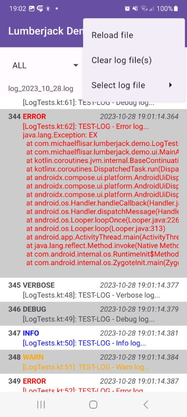

!!! note
    
    This extension does only support android!

```kotlin
// show the log viewer activity (mail address is optional, 
// if it's null, the send mail entry will be removed from the viewers menu)
L.showLog(
    context, 
    fileLoggingSetup, 
    "some.mail@gmail.com"
)
```

| Viewer                                | |
|---------------------------------------|-|
|  |  |
