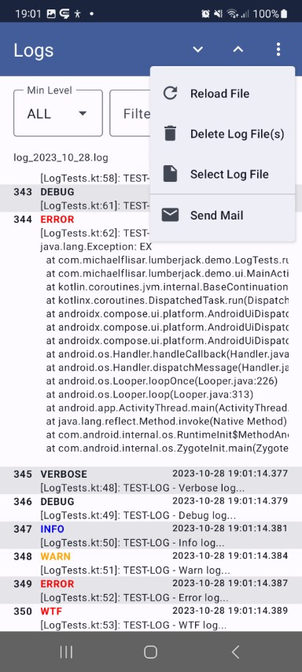

## ComposeViewer Extension

This small extension simply allows you to send a log file via mail (no internet connection required). This will be done by sharing the file as email `Intent`.

If you use compose in your app you should use this viewer - it allows you to show log files directly inside your app.

```kotlin
val showLogViewer = rememberSaveable {
    mutableStateOf(false)
}
LumberjackDialog(
    visible = showLogViewer,
    title = "Logs",
    setup = <a file logging setup>,
    mail = "some.mail@gmail.com"
)
```

Alternatively you can always embed the view directly like following:

```kotlin
LumberjackView(
    setup = <a file logging setup>,
    file = rememberLogFile(),
    // optional
    style = LumberjackViewDefaults.style(),
    data = rememberLogFileData(),
    modifier = Modifier,
    state = rememberLazyListState(),
    darkTheme = isSystemInDarkTheme(),
    useScrollableLines = remember { mutableStateOf(false) }
)
```


> [!TIP]
> You can also embed the whole dialog "content view" inside a layout if you want to also show the menu and use it's features

```kotlin
LumberjackDialogContent(
    title = "Logs",
    setup = <a file logging setup>,
    style= LumberjackViewDefaults.style(),
    darkTheme = isSystemInDarkTheme(),
    mail = null
)
```

| Compose Viewer | |
|-|-|
|  |  |